## F5 Azure Lab Day

For this lab day we will utilize the Microsoft Azure Cloud to deploy a vulnerable web application and a 2 NIC BIG-IP Advanced WAF appliance via an Ansible playbook.  We will then utilize an Ansible playbook to deploy L7 application services using an AS3 declaration.

### Lab Topology

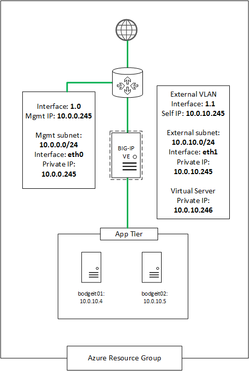

| Device | Network | IP Address  |
| ------ | ------- | ----------  |
| BIG-IP | Mgmt    | 10.0.0.245 |
|        | External| 10.0.10.245|
|        | External| 10.0.10.246|
| Server 1 | External | 10.0.10.4|
| Server 2 | External | 10.0.10.5|

#### Lab

  * Getting Started

    * Run the docker container:

      ` sudo docker run -it --rm ajgerace/f5automation`

    * Clone this repo into the container

      `git clone https://github.com/ajgerace/azure-f5`

    * Change directory to the newly created azure-f5

      `cd azure-f5`

    * Run Bash script to create Service Principle and application.        
     `./spCreate.sh`

     You will be prompted for three values:
     * Student Name
     * Domain
     * Password

     This script will output entries like these:

| Variable             | Value |
| --------------------:|------:|  
| azure_client_id      | abcd_xxxxx |
| azure_secret         | abcd_xxxxx      |
| azure_subscription_id| abcd_xxxxx      |
| azure_tenant_id      | abcd_xxxxx      |
| azure_user           | studentID      |
| azure_user_pass      | VerySecurePassword |

  * These values have been copied to group_vars/all/vault.yml for you

    * Encrypt the ansible vault file

      `ansible-vault encrypt group_vars/all/vault.yml`

    * You can use **ansible-vault view** to view the decrypted values

      `ansible-vault view group_vars/all/vault.yml`

    * Use cat to view the encrypted contents of the vault file

      `cat group_vars/all/vault.yml`

  ## Module 1 - Build out initial environment

  * Run ansible playbook - create Azure resource group

    `ansible-playbook -i notahost, f5agility.yml -e deploy_state=present --tags rg`

  * Run ansible playbook - create application servers

    `ansible-playbook -i notahost, f5agility.yml -e deploy_state=present --tags app`

  * Run ansible playbook - create BIG-IP

    `ansible-playbook -i notahost, f5agility.yml -e deploy_state=present --tags 2nic`

  * Run ansible playbook - setup base profiles

    `ansible-playbook -i notahost, f5agility.yml -e deploy_state=present --tags vs`

    Once complete you can connect to the BIG-IP management Public IP displayed in on the terminal window.

    ** Notice** You may need to scroll up in the Terminal.

    * Open a browser (Firefox) and connect to the management public IP.

      * Review the following BIG-IP configuration objects:
        * Local Traffic
          * HTTP Profiles
          * TCP Profiles
          * HTTP Monitor
          * iRules
        * Networking
          * VLANs
          * SelfIPs
          * Routes
          * DNS Resolver
        * Security
          * Logging Profiles
        * Platform
          * DNS resolver
          * NTP

  * Deploy L7 Application Services

      `ansible-playbook -i notahost, f5agility_create_services.yml`

      This playbook will deploy a HTTPS virtual server and utilize Azure Service discovery to find nodes and add them to the application pool for the BodgeIt vulnerable application

      When complete, review the configuration built.  These will be located in the as3_azure_eastus partition.

 **_Note_**: If you receive an _SSL Read operation timeout_ error when running the create_services playbook, please re-run the playbook.

The url to the virtual server was displayed in the output from the above command.
Copy and paste the url into your browser.
You should initially receive a certificate challenge and then the Bodgeit applicaiton should be displayed.

  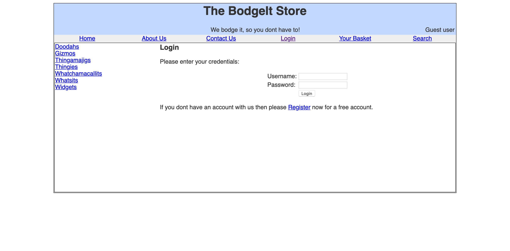

  * Perform a SQL Injection attack
      * On the login page enter the following in the Username field and click Login
      `admin@thebodgeitstore.com' or '1'='1`

  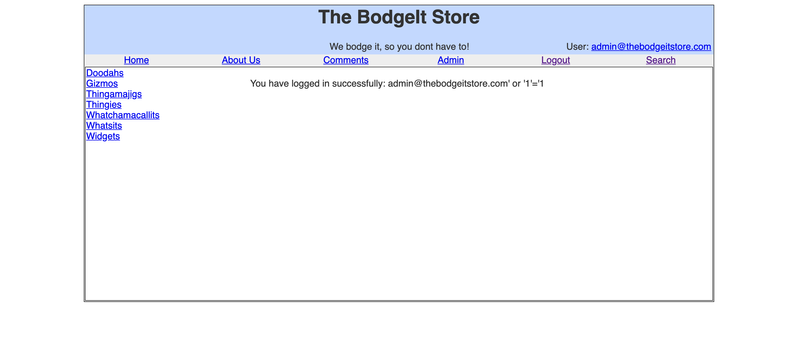

  **Notice** that you logged into the application and a new menu *Admin* is displayed.

  * Perform a Cross Site Scripting attack
    * Click on the Search menu option
    * In the search box enter the following and click Search

      ``

    **Notice** the pop-up box containing Hacked/XSS

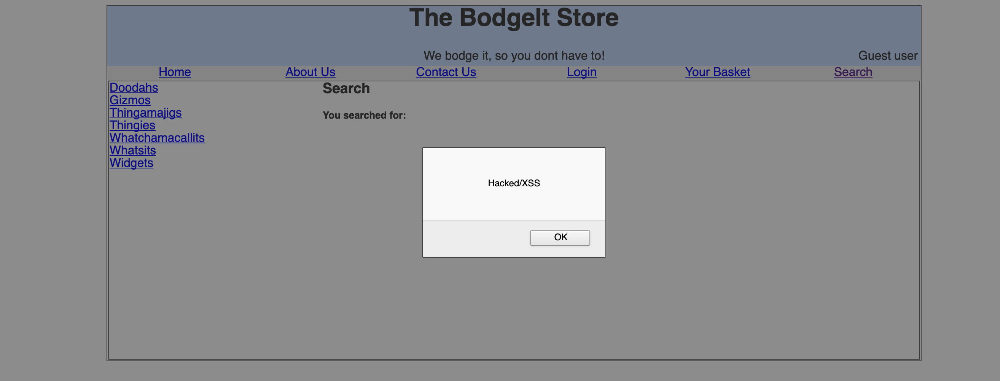

## Module 2 - Enable Application security
  * Edit the f5agility_create_services.yml file using your favorite text editor
      * Change the declareFile variable
         value to **as3_azure_bodgeit_waf**

    * Re-run the  f5agility_create_services ansible playbook
      `ansible-playbook f5agility_create_services.yml`

      * Verify that the vs_bodgeit_443 virtual server has a application security policy and a logging profile associated with it.

        * Perform a SQL Injection attack
          * On the login page enter the following in the Username field and click Login
          `admin@thebodgeitstore.com' or '1'='1`

          * What happened? Did you receive the same page as before?  

          * You should be a blocking page similar to this

  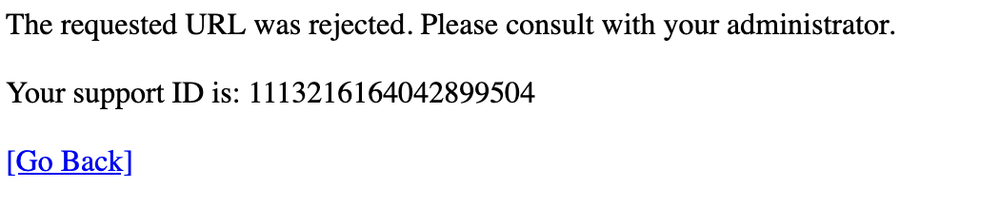

  * Perform a Cross Site Scripting attack
      * Click on the Search menu option
      * In the search box enter the following and click Search

        ``
      * What happened? Did you receive the same pop-up as before?     

        * Look at the Application Security log
          * Click on **Security**
          * Click **Event Log**
          * Click **Application**
          * Click **Requests**

  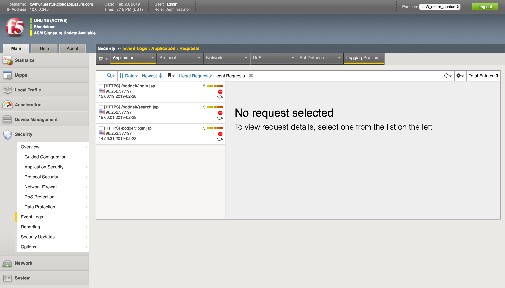

  * Click on one of the entries to get more information regarding the violation

  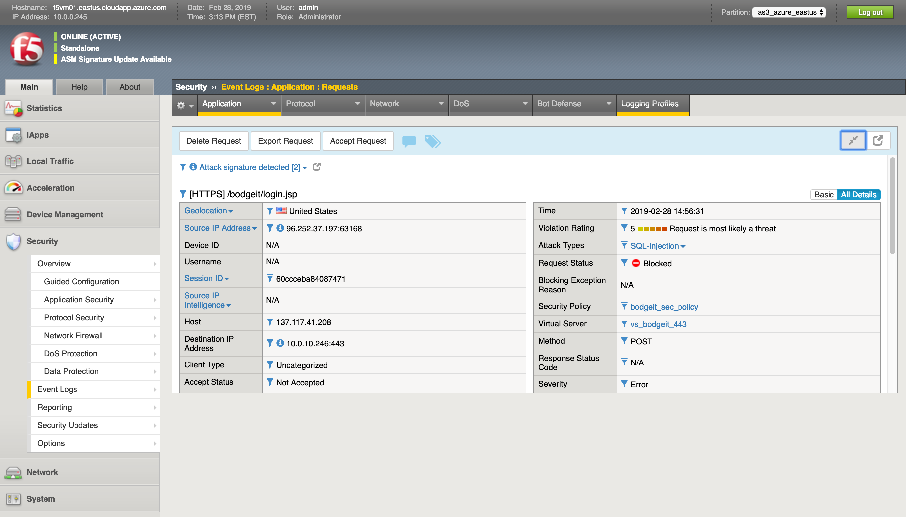

  ## Module 3 - Denial of Service - Bot Protection
  * Create DoS profile
    * Click Security
    * Click DoS Protection
    * Click DoS Profiles
    * Click Create
    * Enter bodgeit_dos_profile in the name field
    * Click **Finished**

  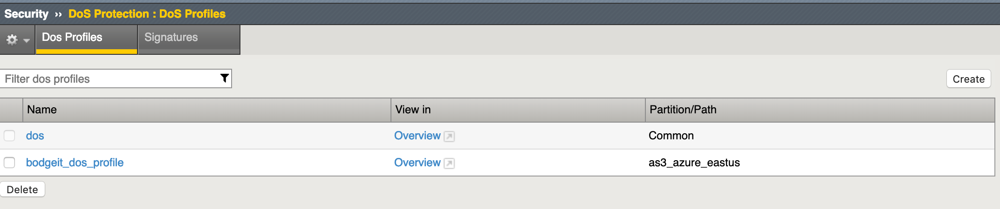

  * Click on the new profile you created
    * Click Application Security menu
      * General Settings - **Enable** Application Security
      * Proactive Bot Defense - Toggle Operational Mode to **Always**
      * Adjust Grace Period from 300 seconds to **30** seconds
      * Toggle TPS based detection's Operational Mode from blocking to **Off**
      * Click **Update**

  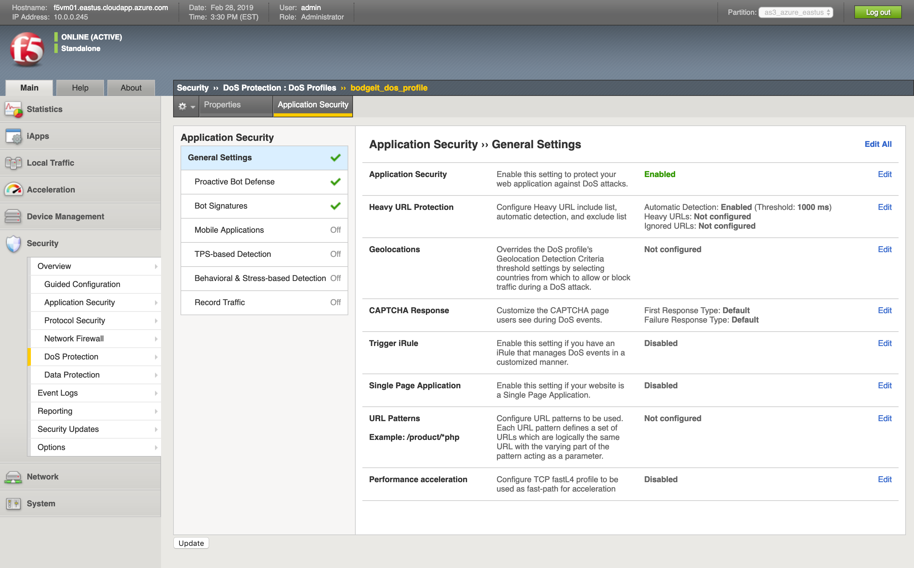

  * Click **Local Traffic**
  * Click **Virtual Server**
  * Click **vs_bodgeit_443**
  * Click **Security**
  * Click **Policies**
  * Enable the DoS profile you just created

  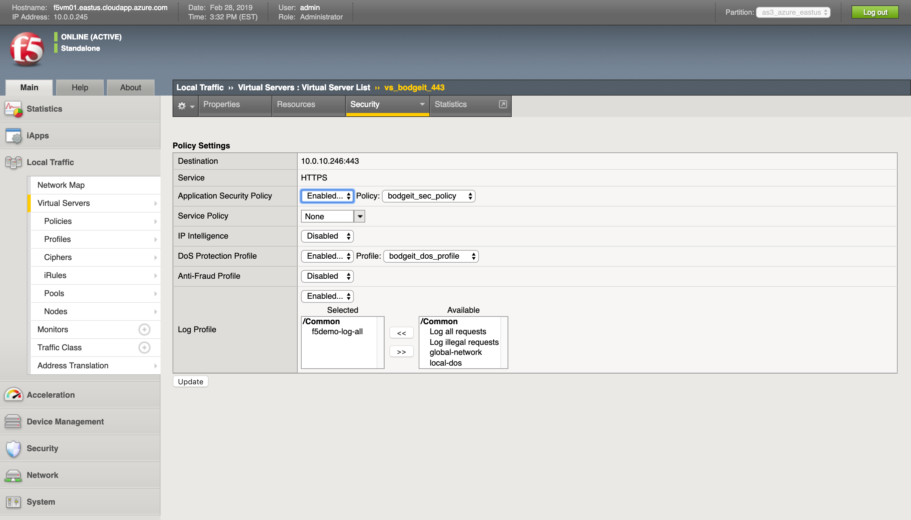

  * Click around the Bodgeit application
  * You should not notice a difference, pages should load without problem.

  * From the terminal window execute attack on the bodgeit site

      `ab -c 1 -n 100 -r https://VIP/bodgeit/login.jsp`

* Review logs at Security -> event logs -> BoT Defense : requests

  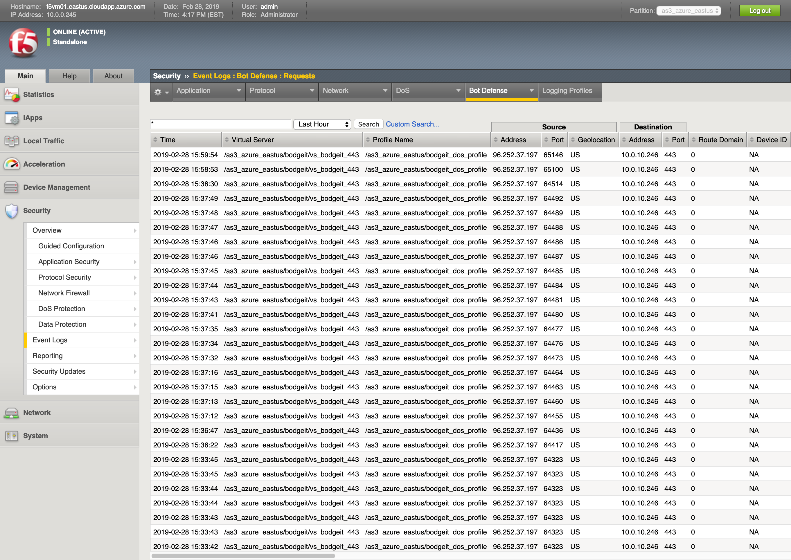

  ## Module 4 - Remove Lab configuration

  * Run f5agility ansible playbook with a deploy_state=absent to teardown your environment.
    `ansible-playbook f5agility.yml -e deploy_state=absent`
  This will rerun the playbook and execute only the roles (decom_az_env). This will remove the resource group and all the configurations with-in it.

  You have now reached the end of the lab.
